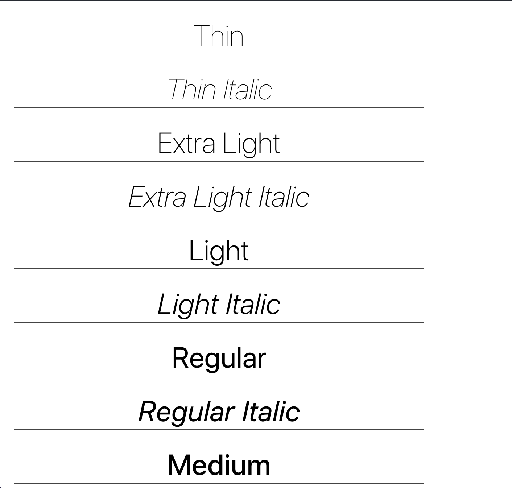

# Font Showcase Component

Used for troubleshooting font-loading in React apps. A showcase component for font families that displays _all_ of the font weights for a given font-family, both regular and italicized.

Use this when you want to ensure that all of your web-fonts are being loaded.



## Usage

There is only one prob used in this component.

```js
import FontShowcase from "font-showcase-component";

<FontShowcase fontFamily="'Raleway', sans-serif" />;
```
